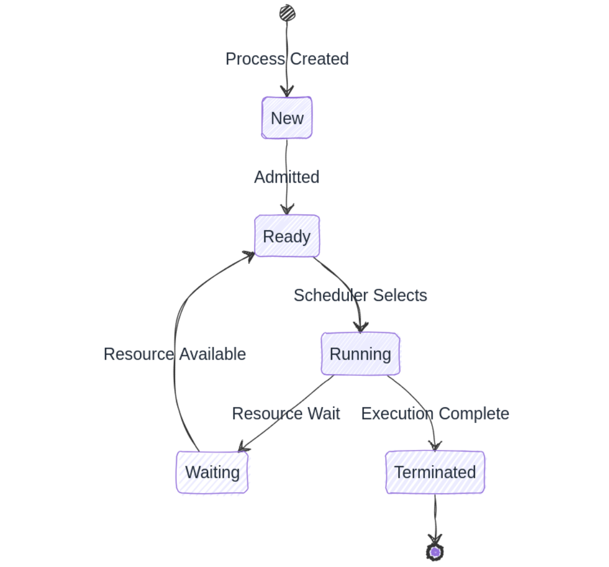

# Day 01: Deep Dive into Process Concepts in Operating Systems

## Table of Contents
1. [Introduction](#1-introduction)
2. [What is a Process?](#2-what-is-a-process)
3. [Process Definition and Components](#3-process-definition-and-components)
4. [Process Memory Layout](#4-process-memory-layout)
5. [Process States](#5-process-states)
6. [Process Control Block (PCB)](#6-process-control-block-pcb)
7. [Practical Implementation](#7-practical-implementation)
8. [Code Example](#8-code-example-process-information-demonstration)
9. [References and Further Reading](#9-references-and-further-reading)
10. [Conclusion](#10-conclusion)
11. [Learning Pathway](#11-learning-pathway)

## 1. Introduction
In the intricate world of operating systems, understanding processes forms the fundamental building block of computational execution. This comprehensive exploration will unravel the complexities of processes, providing you with a deep, low-level understanding of how modern operating systems manage computational tasks.

## 2. What is a Process?
A process is a dynamic instance of a computer program during execution. Unlike a static program stored on disk, a process represents an active entity with its own resources, memory space, and execution context. It's essentially a program in action, containing not just the code but all the computational resources required for its execution.

### Key Characteristics of Processes:
- **Dynamic Execution**: Active program with ongoing computational state
- **Resource Allocation**: Dedicated memory, CPU time, and system resources
- **Independent Execution Context**: Isolated memory space and execution environment



## 3. Process Definition and Components
A process comprises several critical components that define its structure and behavior:

### a. Program Code (Text Section)
- Contains the compiled machine instructions
- Read-only and shared among process instances
- Represents the static algorithmic logic of the program

### b. Data Section
- Stores global and static variables
- Divided into initialized and uninitialized data
- Provides persistent storage for program-wide data

### c. Stack
- Manages function call mechanisms
- Stores local variables, function parameters
- Supports dynamic memory allocation for function executions
- Grows and shrinks during program runtime

### d. Heap
- Dynamic memory allocation area
- Used for runtime memory requests
- Managed manually in languages like C (malloc/free)
- Provides flexible memory management

## 4. Process Memory Layout
Modern operating systems organize process memory in a structured manner:

```
High Virtual Memory Address
+---------------------------------------------------+
| Kernel Address Space (Isolated) |
| ◆ Kernel code, read-only data (shared) |
| ◆ Per-process kernel stack and metadata |
| ◆ Page tables, scheduling info |
| ◆ Protected from user access |
+---------------------------------------------------+
| Stack |
| ◆ Dynamic memory for function calls |
| ◆ Local variables |
| ◆ Grows downward ↓ |
+---------------------------------------------------+
| Heap |
| ◆ Dynamic memory allocation |
| ◆ malloc(), new() |
| ◆ Grows upward ↑ |
+---------------------------------------------------+
| Uninitialized Data (BSS) |
| ◆ Zero-initialized static variables |
+---------------------------------------------------+
| Initialized Data |
| ◆ Initialized global and static variables |
+---------------------------------------------------+
| Program Text |
| ◆ Executable instructions |
| ◆ Read-only memory |
+---------------------------------------------------+
Low Virtual Memory Address
```

### Key Characteristics

1. **Memory Organization**: Process memory is organized from low to high addresses, starting with the text segment and moving toward kernel space.

2. **Dynamic Regions**:
   - **Stack**: Grows downward and is used for function calls, local variables.
   - **Heap**: Grows upward and is used for dynamic memory allocation via `malloc()` or `new()`.

3. **Static Regions**:
   - **BSS**: Uninitialized global/static variables.
   - **Data**: Initialized global/static variables.
   - **Text**: Executable program code; read-only.

4. **Kernel Address Space**:
   - The kernel memory is not part of the user process's directly accessible memory.
   - Portions of the kernel (e.g., code and read-only data) may be mapped into each process's address space but remain protected.
   - Each process has its own **kernel stack**, **scheduling information**, and **page tables**, which are **not shared**.
   - `vmalloc()` is used internally by the kernel to allocate **virtually contiguous memory regions**, typically for large kernel data structures or modules.

> **Security Note**: The kernel address space is isolated from user space for protection. User-mode processes cannot directly access kernel memory.


> **Note**: We will go more in-depth on this topic in the future.

## 5. Process States
A process transitions through multiple states during its lifecycle:

1. **New**: Process being created
2. **Ready**: Prepared for execution, waiting for CPU allocation
3. **Running**: Currently executing instructions
4. **Waiting**: Paused, waiting for external event (I/O, resource)
5. **Terminated**: Execution completed, resources being deallocated

## 6. Process Control Block (PCB)

The Process Control Block is a data structure containing all necessary information about a process:

- Process ID (PID)
- Process State
- Program Counter
- CPU Registers
- CPU Scheduling Information
- Memory Management Details
- Accounting Information
- Open File Descriptors / File Table
- Signal Handlers
- User Credentials (UID, GID)
- I/O State


## 7. Practical Implementation

### Process Creation Mechanisms
Processes can be created through:
- System initialization
- User request to create new process
- Spawning child processes
- Batch job scheduling

## 8. Code Example: Process Information Demonstration

```c
#include <stdio.h>
#include <unistd.h>
#include <sys/types.h>

int main() {
    pid_t process_id = getpid();   // Current process ID
    pid_t parent_process_id = getppid();  // Parent process ID

    printf("Current Process ID: %d\n", process_id);
    printf("Parent Process ID: %d\n", parent_process_id);

    return 0;
}
```

## 9. References and Further Reading

* Silberschatz, A., Galvin, P. B., & Gagne, G. (2018). Operating System Concepts
* Tanenbaum, A. S. (2006). Modern Operating Systems
* Linux Manual Pages (man7.org)
* IEEE POSIX Standards Documentation

## 10. Conclusion
Processes represent the fundamental unit of computation in modern operating systems. Understanding their structure, lifecycle, and management provides insights into how computers execute complex computational tasks efficiently and systematically.

**Key Takeaways:**
* Processes are dynamic, active program instances
* They have structured memory layouts
* Multiple states govern their execution
* Process Control Blocks manage critical metadata

## 11. Learning Pathway
This exploration of process concepts sets the foundation for understanding advanced operating system principles. In subsequent days, we'll dive deeper into process states, creation mechanisms, and scheduling algorithms.

***Next in Series: Day 2 - Process States and Transitions***
> Note: Code examples and demonstrations are best understood through practical execution and experimentation.